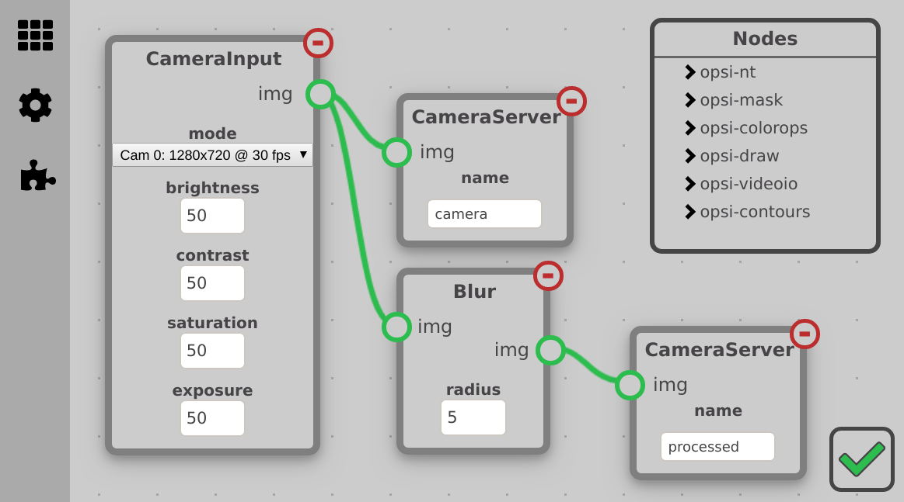

# OpenSight: the powerful, easy-to-use vision suite

    
    
    
    
    

OpenSight is an FRC-focused, free and open source computer vision system targeted specifically for the Raspberry Pi. Our goal is to make it easy for people not familiar with vision to be able to make complex pipelines, while also providing powerful functionality for advanced users.

### **[Click here for information on how to install and use OpenSight!](https://opensight-cv.github.io/)**

## About

Our mission is to create an accessible vision suite, with an easy-to-use and works out-of-the box experience, but also allow for more power and greater customizability. We want to make vision more accessible to those with less experience, while also providing the tools for power users and developers to easily add features beyond the default modules.

### Have any questions, comments, or want to contribute?
You can learn more about contributing [here](https://opensight-cv.github.io/roadmap/)! TL;DR: Join the OpenSight [Discord server](https://discord.gg/hPqpdsK) and we'll get you set up!

## How it works
The main components of the OpenSight vision framework are the **modules** and the **pipeline**. 
Vision nodes can be connected to each other to form a vision pipeline which can detect and track targets. OpenSight comes with basic modules such as input from a camera, OpenCV image processing functions, and a FRC Camera Server implementation to show a camera stream on an FRC Dashboard such as Shuffleboard.

### Modules
The modules determine what the vision pipeline tracks and to what extent. OpenSight modules take after cv image operations, allowing the user to have much greater control over the vision pipeline.

A basic example of a common pipeline: 
**Camera Input** -> **Blur** -> **HSV Range** -> **Find Contours** -> **Find Center** -> 
**NetworkTables**

This of course is just a simple setup, and because an OpenSight pipeline can split into multiple paths, you can customize as much as you want, and even track multiple targets at once.

One unique advantage of OpenSight is its extendability. You can create your own module and with a simple pull request, make it available to any other team! [Here](https://opensight-cv.github.io/module-dev/intro/)

# Licensing

OpenSight is free and open source software, now and forever. It is licensed under the MIT License. This means you can modify it, use the program commericially, and use it privately. You may also redistribute it, under the condition it is also distributed under the same or a stricter license. This statemenet is not legal advice, please read the license for full details. You can find the full terms of the license in the [LICENSE file](https://github.com/opensight-cv/opensight/tree/master/LICENSE).

**Font Awesome**

This project uses Font Awesome icons, as seen on the left navigation bar. Font Awesome is licensed under Creative Commons Attribution 4.0. You can find the details of this license [here](https://fontawesome.com/license/free).
